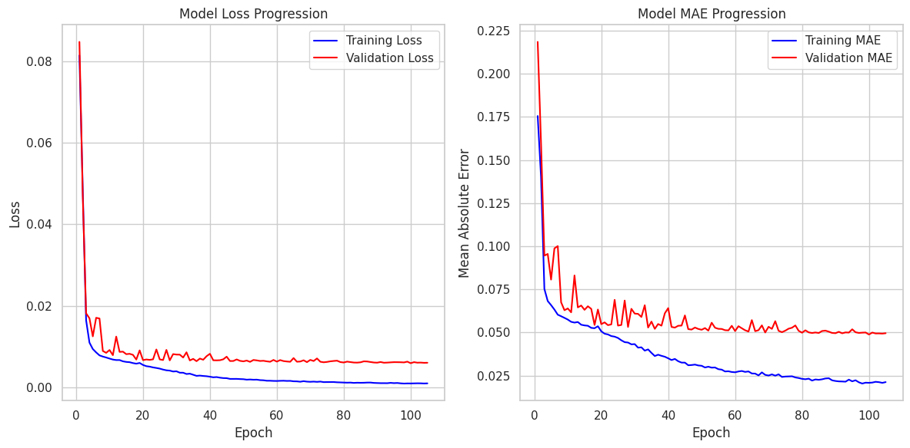
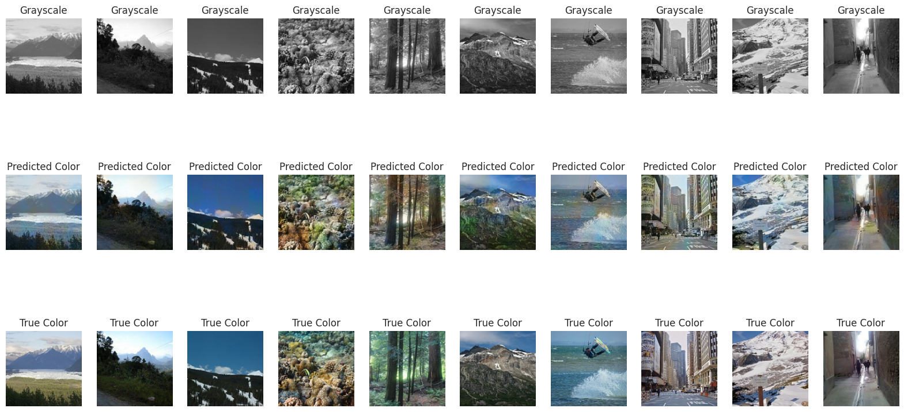
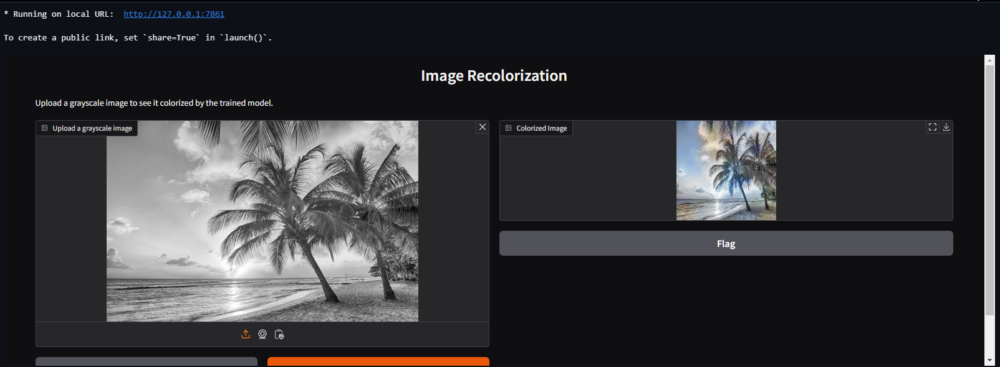

# Re-Colorization of GrayScale Images

This repository provides a deep learning model for colorizing grayscale images using a convolutional autoencoder. It aims to predict realistic colors for grayscale images, particularly landscapes, by leveraging a deep neural network trained on thousands of images.

## Overview
The model is trained on pairs of grayscale and color images, learning to map grayscale pixel values to their respective colors. This project showcases the architecture and training of the model, with visualizations of the colorization results.

### Project Structure
+ Data Preparation: Images are loaded, resized, and normalized for training.
+ Model Architecture: An encoder-decoder architecture based on convolutional layers is used for learning colorization patterns.
+ Training: The model is trained on a dataset of images with mean squared error as the loss function.
+ Evaluation: The colorized results are compared against the original color images using PSNR and SSIM metrics.
## Model Architecture
The model architecture consists of an encoder for downsampling grayscale images and a decoder for reconstructing the colorized image. Key components include:

1. Encoder:
  + Multiple convolutional layers for feature extraction with downsampling.
  + Batch normalization and Leaky ReLU activation.
2. Decoder:
  + Transposed convolution layers for upsampling.
  + Concatenation layers to retain spatial information from the encoder layers.
  + A final convolution layer with a sigmoid activation to output the colorized image.
Below is a sample architecture summary:

```yaml
┏━━━━━━━━━━━━━━━━━━━━━┳━━━━━━━━━━━━━━━━━━━┳━━━━━━━━━━━━┳━━━━━━━━━━━━━━━━━━━┓
┃ Layer (type)        ┃ Output Shape      ┃    Param # ┃ Connected to      ┃
┡━━━━━━━━━━━━━━━━━━━━━╇━━━━━━━━━━━━━━━━━━━╇━━━━━━━━━━━━╇━━━━━━━━━━━━━━━━━━━┩
│ input_layer         │ (None, 160, 160,  │          0 │ -                 │
│ (InputLayer)        │ 3)                │            │                   │
├─────────────────────┼───────────────────┼────────────┼───────────────────┤
│ conv2d (Conv2D)     │ (None, 80, 80,    │      3,584 │ input_layer[0][0] │
│                     │ 128)              │            │                   │
├─────────────────────┼───────────────────┼────────────┼───────────────────┤
│ leaky_re_lu         │ (None, 80, 80,    │          0 │ conv2d[0][0]      │
│ (LeakyReLU)         │ 128)              │            │                   │
├─────────────────────┼───────────────────┼────────────┼───────────────────┤
│ conv2d_1 (Conv2D)   │ (None, 40, 40,    │    147,584 │ leaky_re_lu[0][0] │
│                     │ 128)              │            │                   │
├─────────────────────┼───────────────────┼────────────┼───────────────────┤
│ leaky_re_lu_1       │ (None, 40, 40,    │          0 │ conv2d_1[0][0]    │
│ (LeakyReLU)         │ 128)              │            │                   │
├─────────────────────┼───────────────────┼────────────┼───────────────────┤
│ conv2d_2 (Conv2D)   │ (None, 20, 20,    │    295,168 │ leaky_re_lu_1[0]… │
│                     │ 256)              │            │                   │
├─────────────────────┼───────────────────┼────────────┼───────────────────┤
│ batch_normalization │ (None, 20, 20,    │      1,024 │ conv2d_2[0][0]    │
│ (BatchNormalizatio… │ 256)              │            │                   │
├─────────────────────┼───────────────────┼────────────┼───────────────────┤
│ leaky_re_lu_2       │ (None, 20, 20,    │          0 │ batch_normalizat… │
│ (LeakyReLU)         │ 256)              │            │                   │
├─────────────────────┼───────────────────┼────────────┼───────────────────┤
│ conv2d_3 (Conv2D)   │ (None, 10, 10,    │  1,180,160 │ leaky_re_lu_2[0]… │
│                     │ 512)              │            │                   │
├─────────────────────┼───────────────────┼────────────┼───────────────────┤
│ batch_normalizatio… │ (None, 10, 10,    │      2,048 │ conv2d_3[0][0]    │
│ (BatchNormalizatio… │ 512)              │            │                   │
├─────────────────────┼───────────────────┼────────────┼───────────────────┤
│ leaky_re_lu_3       │ (None, 10, 10,    │          0 │ batch_normalizat… │
│ (LeakyReLU)         │ 512)              │            │                   │
├─────────────────────┼───────────────────┼────────────┼───────────────────┤
│ conv2d_4 (Conv2D)   │ (None, 5, 5, 512) │  2,359,808 │ leaky_re_lu_3[0]… │
├─────────────────────┼───────────────────┼────────────┼───────────────────┤
│ batch_normalizatio… │ (None, 5, 5, 512) │      2,048 │ conv2d_4[0][0]    │
│ (BatchNormalizatio… │                   │            │                   │
├─────────────────────┼───────────────────┼────────────┼───────────────────┤
│ leaky_re_lu_4       │ (None, 5, 5, 512) │          0 │ batch_normalizat… │
│ (LeakyReLU)         │                   │            │                   │
├─────────────────────┼───────────────────┼────────────┼───────────────────┤
│ conv2d_transpose    │ (None, 10, 10,    │  2,359,808 │ leaky_re_lu_4[0]… │
│ (Conv2DTranspose)   │ 512)              │            │                   │
├─────────────────────┼───────────────────┼────────────┼───────────────────┤
│ re_lu (ReLU)        │ (None, 10, 10,    │          0 │ conv2d_transpose… │
│                     │ 512)              │            │                   │
├─────────────────────┼───────────────────┼────────────┼───────────────────┤
│ concatenate         │ (None, 10, 10,    │          0 │ re_lu[0][0],      │
│ (Concatenate)       │ 1024)             │            │ leaky_re_lu_3[0]… │
├─────────────────────┼───────────────────┼────────────┼───────────────────┤
│ conv2d_transpose_1  │ (None, 20, 20,    │  2,359,552 │ concatenate[0][0] │
│ (Conv2DTranspose)   │ 256)              │            │                   │
├─────────────────────┼───────────────────┼────────────┼───────────────────┤
│ re_lu_1 (ReLU)      │ (None, 20, 20,    │          0 │ conv2d_transpose… │
│                     │ 256)              │            │                   │
├─────────────────────┼───────────────────┼────────────┼───────────────────┤
│ concatenate_1       │ (None, 20, 20,    │          0 │ re_lu_1[0][0],    │
│ (Concatenate)       │ 512)              │            │ leaky_re_lu_2[0]… │
├─────────────────────┼───────────────────┼────────────┼───────────────────┤
│ conv2d_transpose_2  │ (None, 40, 40,    │    589,952 │ concatenate_1[0]… │
│ (Conv2DTranspose)   │ 128)              │            │                   │
├─────────────────────┼───────────────────┼────────────┼───────────────────┤
│ re_lu_2 (ReLU)      │ (None, 40, 40,    │          0 │ conv2d_transpose… │
│                     │ 128)              │            │                   │
├─────────────────────┼───────────────────┼────────────┼───────────────────┤
│ concatenate_2       │ (None, 40, 40,    │          0 │ re_lu_2[0][0],    │
│ (Concatenate)       │ 256)              │            │ leaky_re_lu_1[0]… │
├─────────────────────┼───────────────────┼────────────┼───────────────────┤
│ conv2d_transpose_3  │ (None, 80, 80,    │    295,040 │ concatenate_2[0]… │
│ (Conv2DTranspose)   │ 128)              │            │                   │
├─────────────────────┼───────────────────┼────────────┼───────────────────┤
│ re_lu_3 (ReLU)      │ (None, 80, 80,    │          0 │ conv2d_transpose… │
│                     │ 128)              │            │                   │
├─────────────────────┼───────────────────┼────────────┼───────────────────┤
│ concatenate_3       │ (None, 80, 80,    │          0 │ re_lu_3[0][0],    │
│ (Concatenate)       │ 256)              │            │ leaky_re_lu[0][0] │
├─────────────────────┼───────────────────┼────────────┼───────────────────┤
│ conv2d_transpose_4  │ (None, 160, 160,  │      6,915 │ concatenate_3[0]… │
│ (Conv2DTranspose)   │ 3)                │            │                   │
├─────────────────────┼───────────────────┼────────────┼───────────────────┤
│ re_lu_4 (ReLU)      │ (None, 160, 160,  │          0 │ conv2d_transpose… │
│                     │ 3)                │            │                   │
├─────────────────────┼───────────────────┼────────────┼───────────────────┤
│ concatenate_4       │ (None, 160, 160,  │          0 │ re_lu_4[0][0],    │
│ (Concatenate)       │ 6)                │            │ input_layer[0][0] │
├─────────────────────┼───────────────────┼────────────┼───────────────────┤
│ conv2d_5 (Conv2D)   │ (None, 160, 160,  │        165 │ concatenate_4[0]… │
│                     │ 3)                │            │                   │
└─────────────────────┴───────────────────┴────────────┴───────────────────┘
 Total params: 9,602,856 (36.63 MB)
 Trainable params: 9,600,296 (36.62 MB)
 Non-trainable params: 2,560 (10.00 KB)
```
## Results
**Sample Outputs** 
The model's predictions are shown below. Each row represents:
+ Training Loss and Mae
  
+ Input Grayscale Image Predicted Colorized Image Ground Truth Color Image
  

## Evaluation
To measure the effectiveness of the colorization, we use:
+ Peak Signal-to-Noise Ratio (PSNR): Measures the quality of the predicted colorized image: PSNR: 22.81.
+ Structural Similarity Index (SSIM): Quantifies image similarity between the colorized and ground truth images: SSIM: 0.95.

## Installation and Usage
1. Clone the repository:
  ```bash
  git clone https://github.com/AryanMithbawkar/Re-Colorization-of-GrayScale-Images.git
  ```

## Gradio Interface
This project includes a Gradio interface for uploading grayscale images and receiving colorized outputs.

```python
import gradio as gr 
gr_interface = gr.Interface(
    fn=colorize_image,
    inputs=gr.Image(image_mode='L', label="Upload a grayscale image"),
    outputs=gr.Image(label="Colorized Image"),
    title="Image Recolorization",
    description="Upload a grayscale image to see it colorized by the trained model."
)
```
+ Gradio interface
  
## Acknowledgments
+ [Kaggle Landscape Image Colorization Dataset](https://github.com/AryanMithbawkar/Re-Colorization-of-GrayScale-Images)
+ Various open-source libraries: TensorFlow, Keras, OpenCV, Gradio.
